# **Gruber Fruity Theme Pack**

Theme pack with minimalist themes inspired by the original Gruber themes.
All variants feature a fruity 🫠 and minimalist look, inspired by different
healthy snacks.

## Style [*take me to the screenshots!*](#variants)
The gruber fruity themes take semantic highlighting very seriously. For semantic
highlighting to really help with your workflow, the items that really matter
should stand out in your code. Many modern themes colour almost all items in a file,
which (in the author's opinion) distracts from those elements that really matter.
Therefore, all gruber fruity themes limit themselves to only five colours (and two
neutral background colours), each having a very specific meaning.
- fruity colour - main accent colour for language items like keywords and operators
- leaf green - accent colour for strings and very special names, like `self`/`this` variables and the `super` path
- dead wood - accent colour for constants
- sky blue - accent colour for macros, decorators and other types of metaprogramming
- comment - accent colour for comments

In line with the reduced noise design-style of the gruber fruity themes, all themes
support a minimalist version of vscode's colour matched brackets, with only two
colours (white and grey).

## Language support
All theme variants feature enhanced syntax highlighting support for a few
common languages. In principle, all programming languages are supported, although
your milage may vary. The following languages currently feature enhanced markup 

### Programming languages
- C/C++, Rust, Zig
- Python, Lua, Julia, Javascript/Typescript
- Java
- Go

### Markup languages
- Markdown
- JSON, XML, TOML
- HTML, CSS/SCSS

Note: *Markup languages have a very different purpose then general programming
languages and require a different way of styling, so the functions of the accent
colours may differ for these languages.*

## Fonts
I recommend you use this extension in combination with a great programming font like:
- [JetBrains mono](https://www.jetbrains.com/lp/mono/)
- [FiraCode](https://github.com/tonsky/FiraCode)
- [Source Code Pro](https://fonts.google.com/specimen/Source+Code+Pro)

# Variants
|                 Dark                 |                 Light                 |
|--------------------------------------|---------------------------------------|
| [🍋 Gruber Lemon Dark 🍋](#🍋-gruber-lemon-dark) | *no light variant* |
| [🍎 Gruber Apple Dark 🍎](#🍎-gruber-apple-dark) | [🍒 Gruber Cherry Light 🍒](#🍒-gruber-cherry-light)
| [🍐 Gruber Pear Dark 🍐](#🍐-gruber-pear-dark) | [🫒 Gruber Olive Light 🫒](#🫒-gruber-olive-light)
| [🍑 Gruber Peach Dark 🍑](#🍑-gruber-peach-dark) | [🍊 Gruber Orange Light 🍊](#🍊-gruber-orange-light)
| [🍧 Gruber Sorbet Dark 🍧](#🍧-gruber-sorbet-dark) | [🌸 Gruber Sakura Light 🌸](#🌸-gruber-sakura-light)
| [🍇 Gruber Grape Dark 🍇](#🍇-gruber-grape-dark) | [🫐 Gruber Blueberry Light 🫐](#🫐-gruber-blueberry-light)

## **🍋 Gruber Lemon Dark**
_**Variant:** Dark, **Accent colour**:_ `#ffd900`
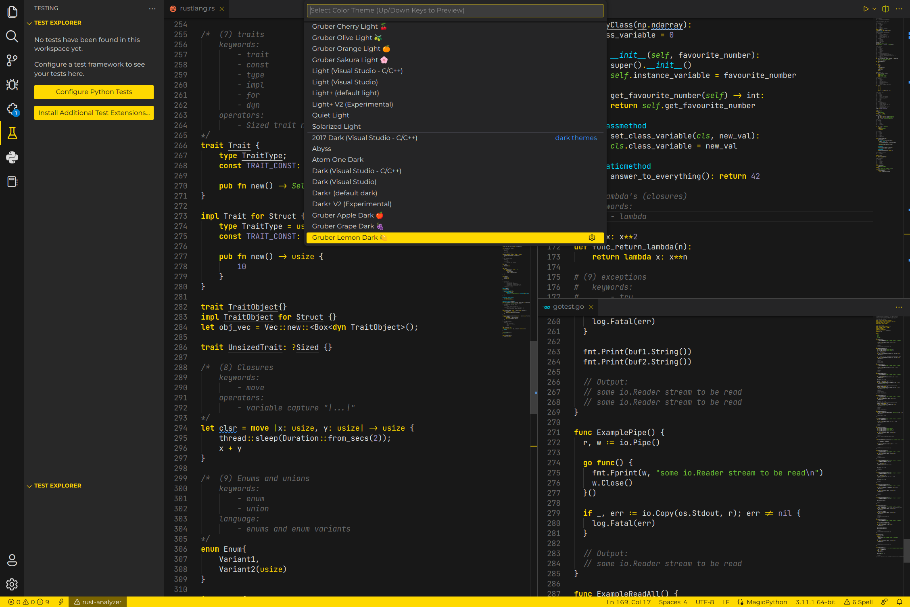

## **🍎 Gruber Apple Dark**
_**Variant:** Dark, **Accent colour**:_ `#ff264e`
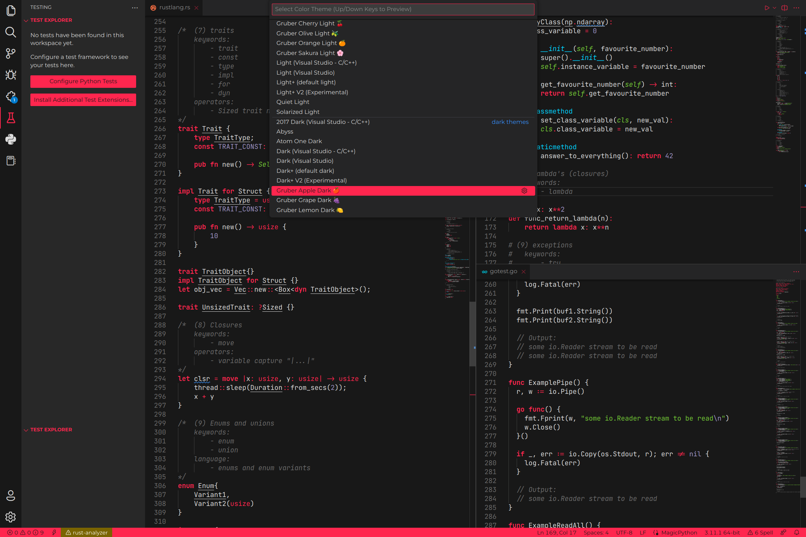

## **🍒 Gruber Cherry Light**
_**Variant:** Light, **Accent colour**:_ `#d61e4c`
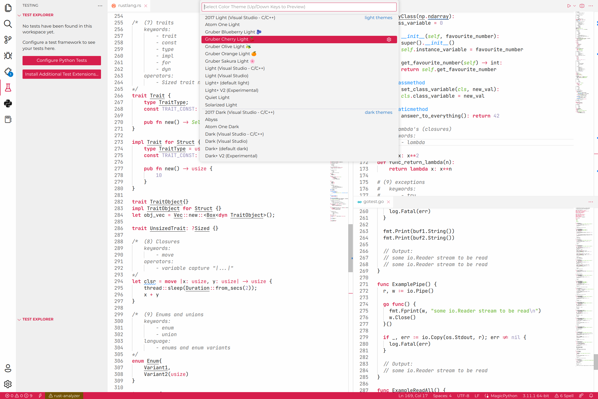

## **🍐 Gruber Pear Dark**
_**Variant:** Dark, **Accent colour**:_ `#80cf30`
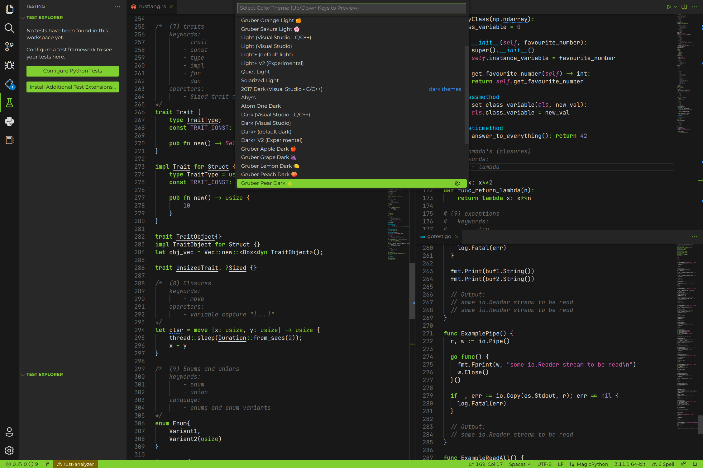

## **🫒 Gruber Olive Light**
_**Variant:** Light, **Accent colour**:_ `#6d8c12`
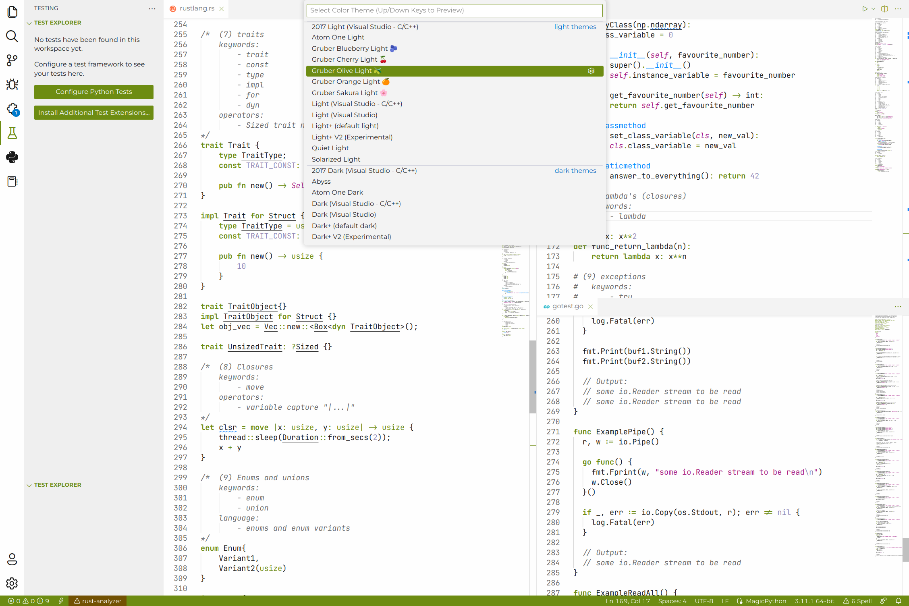

## **🍑 Gruber Peach Dark**
_**Variant:** Dark, **Accent colour**:_ `#fc8d6e`
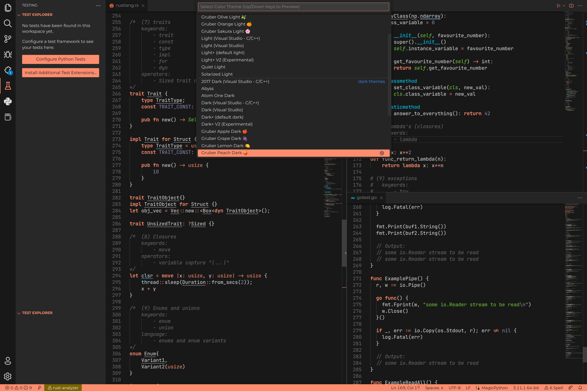
## **🍊 Gruber Orange Light**
_**Variant:** Light, **Accent colour**:_ `#ff8000`
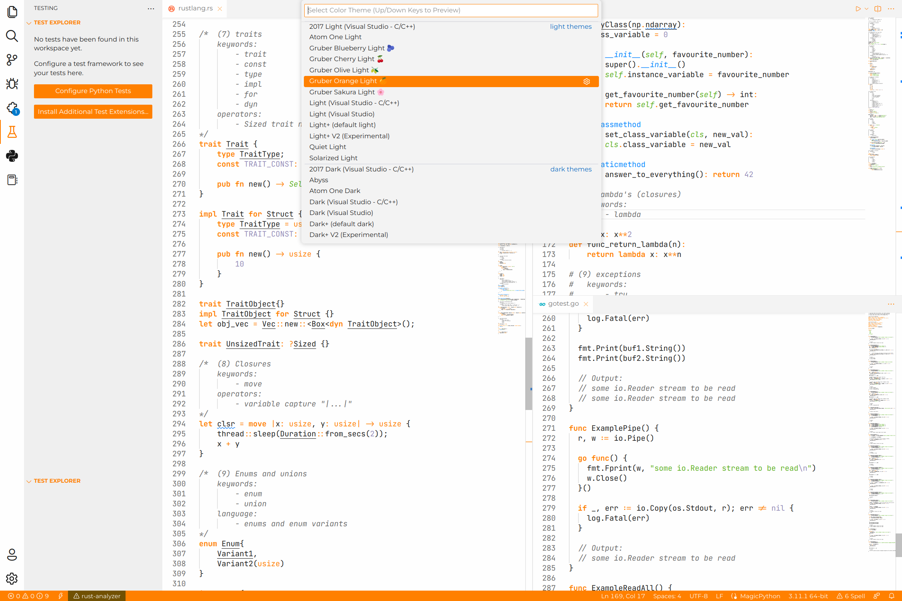

## **🍧 Gruber Sorbet Dark**
_**Variant:** Dark, **Accent colour**:_ `#ffa6c9`
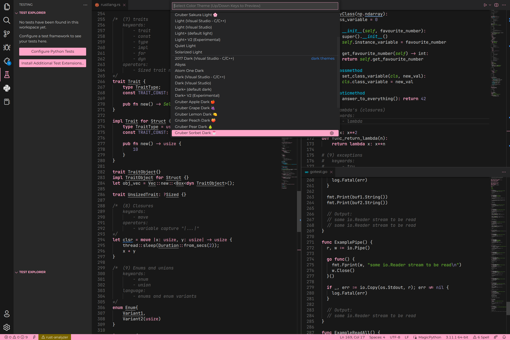

## **🌸 Gruber Sakura Light**
_**Variant:** Light, **Accent colour**:_ `#dd68b4`
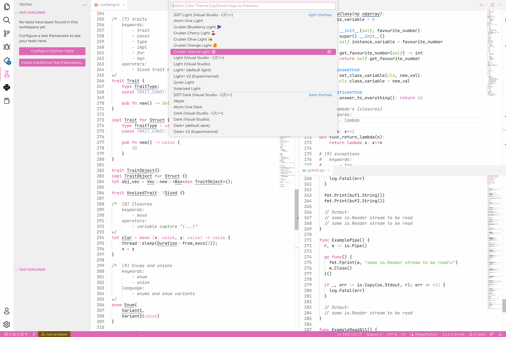

## **🍇 Gruber Grape Dark**
_**Variant:** Dark, **Accent colour**:_ `#bd4dff`
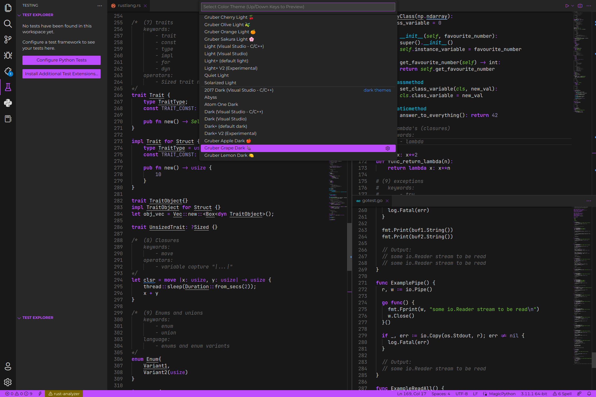

## **🫐 Gruber Blueberry Light**
_**Variant:** Light, **Accent colour**:_ `#4400b3`
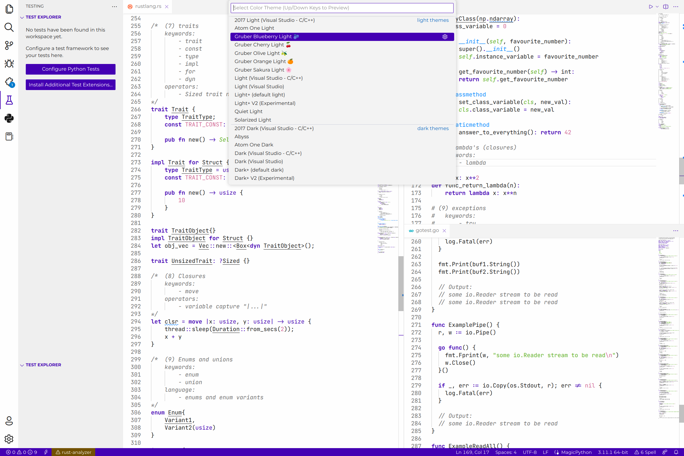